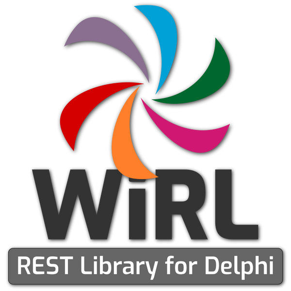

# WiRL: Delphi RESTful Library

<br />
<p align="center">
  
</p>


[](https://github.com/delphi-blocks/WiRL/blob/master/LICENSE)
[](https://github.com/delphi-blocks/WiRL/issues)
[](https://github.comdelphi-blocks/WiRL/pulls)
[](https://github.com/delphi-blocks/WiRL/release)


## Getting Started

Please follow the documentation at [wirl.delphiblocks.dev](https://wirl.delphiblocks.dev/)!

## What is WiRL?

**WiRL** was created to simplify RESTful service implementation in Delphi but, more importantly, to enable maximum interoperability with REST clients written in other languages and tools.

WiRL takes after Java JAX-RS specifications and tries to be compliant with the 6 REST constraints.

WiRL is a high-level REST framework exposing plain Delphi objects (PODO) as RESTful web resources by applying [attributes](http://docwiki.embarcadero.com/RADStudio/Seattle/en/Overview_of_Attributes) to these classes.

```Delphi
[Path('customers')]
TCustomerResource = class
public
  [GET]
  [Produces('TMediaType.APPLICATION_JSON')]
  function SelectCustomers: TCustomerList;

  [POST]
  [Consumes('TMediaType.APPLICATION_JSON')]
  [Produces('TMediaType.APPLICATION_JSON')]
  function InsertCustomer(ACustomer: TCustomer): TCustomer;
end;
```
WiRL has a strong HTTP content negotiation and  defines attributes to bind specific URI patterns and HTTP operations to individual methods of your Delphi class. It has parameter injection attributes so that you can easily pull in information from the HTTP request. It has message body readers and writers that allow you to decouple data format marshalling and unmarshalling from your Delphi objects. It has exception mappers that can map an exception to an HTTP response code and message.

WiRL uses 3 submodules:
1. [Delphi JOSE and JWT Library](https://github.com/paolo-rossi/delphi-jose-jwt) for the JSON Web Token creation and validation
2. [Neon - Serialization Library for Delphi](https://github.com/paolo-rossi/delphi-neon) to convert Delphi simple types, objects, records, arrays, etc... to the JSON format
3. [OpenAPI 3 for Delphi](https://github.com/paolo-rossi/OpenAPI-Delphi) for the OpenAPI documentation generation
